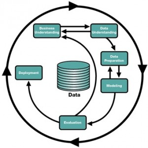
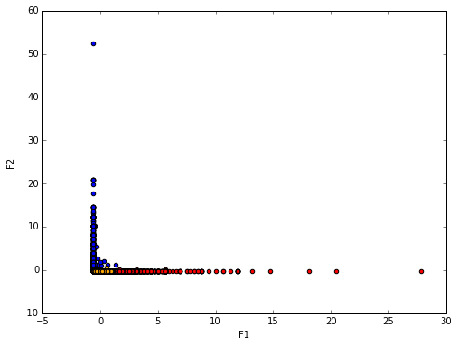

A Data Science project in Banking Domain
===================
`#DataScience` `#RStats` `#Python` `#MachineLearning` `#BigData` `#Spark` 

## Objetive ##

The main objective of this project is to understand if Royal Decree-Law 11/2015, of 2 October, which regulates cash withdrawals fees at ATMs has changed users habits and financial institutions should change their trading policies in order to keep an equilibrium between user satisfactions and revenue generation.

The **scope of the project** is to provide knowledge about a big data set from a short period of time. By applying the same analysis over historical data before the regulation, may provide useful insights to solve business issues. 

## About the methodology ##
The CRISP-DM (*cross-industry process for data mining*) methodology provides a structured approach to planning a data mining task and was applied to this data science project.

### Data acquisition

The data set was provided by EURO 6000 and consists in a `csv` file with *10.651.775 rows*, *36 columns* and *3.557 GB*.

This file was sampled into a representative subset of data points to work with a manageable amount of data in order to build and run analysis and data manipulation more quickly, while still producing accurate findings that finally were applied to the main data set.

### Exploratory data analysis (EDA)

The main tasks during this phase were transforming data, dealing with missing values, visualizing raw data by plotting frequency and distribution charts and finally testing and fitting a statistical model.

#### Variable transformation
Variables were converted into a their right object type and also changed from its measurement scale. 

Working with categorical or factor variables in a big data set can be challenging. By transforming into the write object type we could minimize computational resources.

#### Missing values and outliers
**Missing values**
Many of the categorical variables provided in the data set contained missing information. NA, a logical constant of length 1 which contains a missing value indicator was assigned to these observations so the could be coerced to any other type if needed.

**Outlier detection**
No outliers were detected during the EDA phase where most relevant variables were the most important variables were visualized. We found some big amount operations but no to be classified as extreme values that could affect the result of the analysis. 

### Feature engineering
New variables where generated based on existing ones in order to derive relevant information for the analysis.
This was a reiterative process consisting in:

 1. Create a set of new variables or predictors that could help to test our hypothesis
 2. Diagnose the predictors for high correlation or zero and near-zero values
 3. Run the analysis
 4. Remove uninformative predictors from the dataset
 5. Data transformation: leaving variances unequal is equivalent to putting more weight on variables with smaller variance, so clusters will tend to be separated along variables with greater variance. To avoid this all variables were normalized around the mean.

**Files**:

 1. [`exploratory_data_analysis.md`](exploratory_data_analysis.md): a R Markdown **report** with the detailed EDA  process. A **testing model** was developed and evaluated. Source [here](exploratory_data_analysis.Rmd).
 2. [`data_pre-processing.R`](data_pre-processing.R): a R **script** that reads the data source file, performs data cleaning, wrangling and the feature engineering process. As a result a CSV file is created and ready to be analyzed
 3. [`data_pre-processing.ipynb`](data_pre-processing.ipynb): a Jupyter Notebook that explains data cleaning and pre-processing process using R. 

### Modelling

This is the core activity of the data science project. In order to get insight from the data a Machine Learning algorithm was applied to the selected variables.

**K-means Machine Learning Algorithm visually explained**

*Click the image or refresh this page to watch the animation*

As a result, withdrawal requests were grouped in similar groups turning the analysis into a process of knowledge discovery.

**Files**:

 2. [`clustering.ipynb`](clustering.ipynb): a Jupyter Notebook that performs the data modeling phase over the sample dataset using Python and Spark.
 2.  [`clustering.py`](clustering.py): the final application created to run the K-means machine learning algorithm over the full dataset.
 3. [`data_integration.Rmd`](data_integration.Rmd): a R markdown script that joins clustering results with the original dataset and derive new datasets needed to perform the data analysis and visualization phase.
 4. [`data_integration.md`](data_integration.md): a R markdown **report** explaining how all the datasets were processed by `data_integration.Rmd`.

### Data analysis and visualization

The last phase in this project was trying to  communicate information clearly and efficiently through plotting the findings. 

## About the technology ##
#### Programming languages and interpreters

 - Linux shell: Shell was used intensively to manage files, run scripts, run `ssh` os `scp` commands that send both to the developement plaftorm on **Docker** and the remote cluster. Also used to move files into **Apache Hadoop Distributed File System** (HDFS), a distributed Java-based file system for storing large volumes of data.
 - **R** statistical language: Was used mainly for the EDA phase and the modelling phase over the sample data set.
 - Spark Python API (**PySpark**) : Used to run the K-means algorithm and perform the clustering over the full data set using **Python** programming language 

#### Main libraries

 - `subsample`: a command-line interface for sampling lines from text files that was used to get a sample of the full dataset for testing. 
 `> pip install subsample`
 `> subsample -n 100000 datos.csv -r > sample.csv`
 
 - R `data.table`:  a R package that provides an enhanced version of `data.frame` , especially useful for working with large data sets (*datos.csv size:  3.6 gigabytes*) 
 - `Pandas`: A high-performance, easy-to-use data structures and data analysis tools for Python
 
 - `spark.ml`: The Spark machine learning package provided the K-means algorithm that clusters the data points into a predefined number of clusters.

#### Hardware and Resources

 - MacBook Pro with a 2,2 GHz Intel Core i7 and 16 GB 1600 MHz DDR3 RAM**

> Was used to development phases with the following Operating Systems: 
> Mac OS X El Capitan
> Virtual Box: used to test several bigdata platforms as Horton Works or Cloudera Impala. 
> Docker: The Python development phase was executed in a Docker image available at [hub.docker.com](https://hub.docker.com/r/jrcajide/spark/ "hub.docker.com") Docker with Apache Spark, Python, R (`conda install -c r r-essentials`) and Jupyter Notebook installed. 

 - To get the image: `docker pull jrcajide/spark` 
 - To  run it: `docker run -d -p 8888:8888 jupyter/all-spark-notebook`
 - Login: Get the docker instance: `> docker ps` and ssh: `> docker exec -t -i [replace with the instance id] /bin/bash`

 - A Hadoop cluster with Spark running on Yarn.

## How to run this analysis

**Reading, transforming and feature engineering**

    Rscript data_pre-processing.R 

**Compress the csv file (Recommended)**
    
    tar -zcvf data_scaled.tar.gz data_scaled.csv
    ls
    -rw-r--r--    1 JOSE  staff  223390136  7 jun 15:28 data_scaled.csv
    -rw-r--r--    1 JOSE  staff   35391541  7 jun 15:31 data_scaled.tar.gz
**Upload the compressed file to the remote server**

    scp -P 22010 data_scaled.tar.gz kschool06@cms.hadoop.flossystems.net:data_science/
        data_scaled.tar.gz                                                                    100%   34MB   3.8MB/s   00:09  
**Upload the Python app to the remote server**

    scp -P 22010 clustering.py kschool06@cms.hadoop.flossystems.net:data_science/
    clustering.py                                                                         100% 2888     2.8KB/s   00:00   
**Connect to the remote server**

    ssh -p 22010 kschool06@cms.hadoop.flossystems.net

**Once into the server, uncompress the data and move it into HDFS**

    cd data_science/
    tar -zxvf data_scaled.tar.gz 
    ls -al
    
    -rw-r--r-- 1 kschool06 kschool06 223390136 Jun  7 15:28 data_scaled.csv
    -rw-r--r-- 1 kschool06 kschool06  35391541 Jun  7 15:34 data_scaled.tar.gz
    hdfs dfs -ls
    drwxr-xr-x   - kschool06 supergroup          0 2016-06-07 14:41 .sparkStaging
    drwxr-xr-x   - kschool06 supergroup          0 2016-03-18 17:51 data
    hdfs dfs -mkdir clustering
    hdfs dfs -ls
    drwxr-xr-x   - kschool06 supergroup          0 2016-06-07 14:41 .sparkStaging
    drwxr-xr-x   - kschool06 supergroup          0 2016-06-07 15:40 clustering
    drwxr-xr-x   - kschool06 supergroup          0 2016-03-18 17:51 data
    hdfs dfs -put data_scaled.csv clustering/
    hdfs dfs -ls clustering
    -rw-r--r--   3 kschool06 supergroup  223390136 2016-06-07 15:40 clustering/data_scaled.csv

**Run the app**

     PYSPARK_PYTHON=/opt/cloudera/parcels/Anaconda/bin/python spark-submit --conf "spark.kryoserializer.buffer.max=2047" clustering.py    

**Get the result file**

In the *client*:

    scp -P 22010 kschool06@cms.hadoop.flossystems.net:data_science/results.csv results.csv

If the Python app was configured to store the K-means clustering result into Hadoop, then enter this commands:
In the *server*:

    hdfs dfs -copyToLocal clustering/results results
    hdfs dfs -rm -R -skipTrash clustering/results
In the *client*:

    scp -r -P 22010 kschool06@cms.hadoop.flossystems.net:~/data_science/results results
**Data integration**

    Rscript data_integration.Rmd 
  

## About the authors

**Marta Cámara Jiménez**
Data Science & Negocio en EURO 6000
https://www.linkedin.com/in/martacamarajimenez
[@mcamarajimenez](https://twitter.com/mcamarajimenez)

**Jose Ramón Cajide**
Digital Analyst at El Arte de Medir 
https://www.linkedin.com/in/jrcajide
[@jrcajide](https://twitter.com/jrcajide)
  

    
    
    