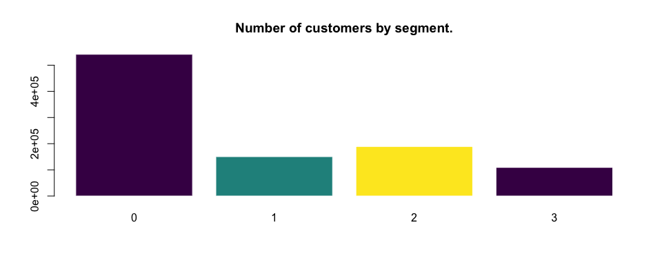
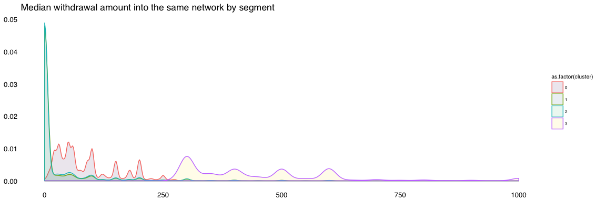
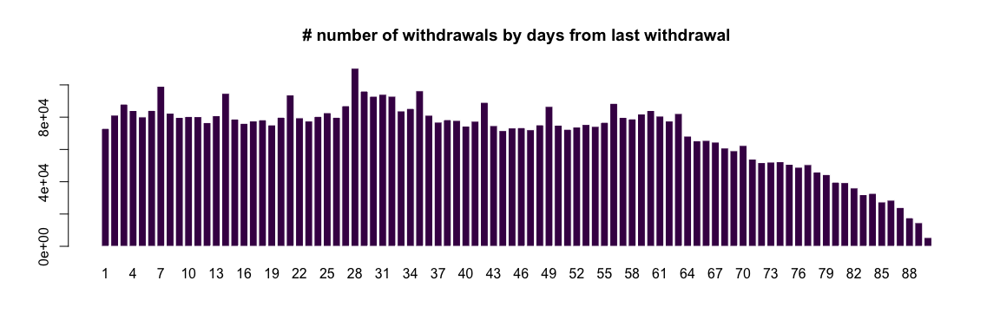
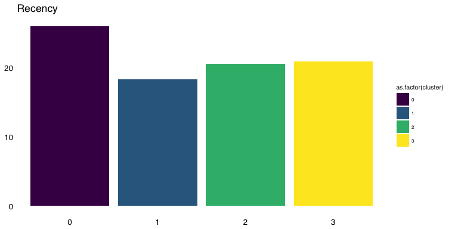
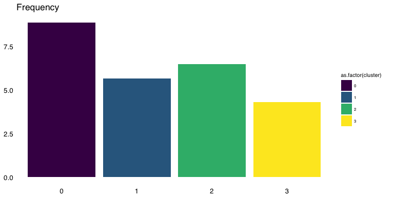
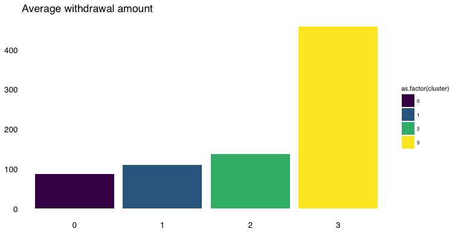
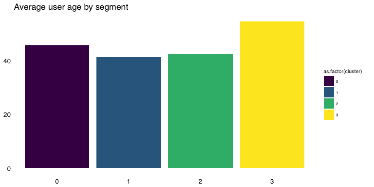
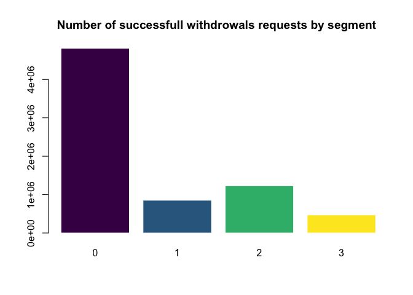

Data integration
================
13 June 2016

The last process before analyze and visualize the results is to integrate all the data sets.

In this phase we query, transform, group, summarize and merge information in several ways to create two datasets. The first one will hold user data and the second withdrawl data.

R package `data.table` was used again for high resource consuming tasks over a big data set with more than 7MM observations.

**Reading data**

In the first step we read the original dataset and the results obtained from running the clustering algorithm

``` r
knitr::opts_chunk$set(echo = TRUE,fig.align='center')

list.of.packages <- c("data.table", "ggplot2","ggplot2","knitr","viridis","ggthemes","knitr")
new.packages <- list.of.packages[!(list.of.packages %in% installed.packages()[,"Package"])]
if(length(new.packages)) install.packages(new.packages)
```

A quick plot to check how many users where assigned to each segment.

``` r
# Number of users by cluster
barplot(table(DT.r$cluster), main="Number of customers by segment.", col=viridis(3), border = "white")
```



``` r
# Load not scaled variables
DT.c <- readRDS("./data/DTc.rds")

# Add the cluster variable to scaled data frame
DT.clients <- merge(
  DT.c, 
  DT.r[,c("PER_ID_PERSONA", "cluster"), with = FALSE], 
  by=c('PER_ID_PERSONA')
)

# Calculate the median for each variable by cluster
cluster_medians.df <- aggregate(DT.clients[, 2:7, with = FALSE], by = list(DT.clients$cluster), median)

write.table(cluster_medians.df, file.path('data/cluster_medians.csv'), row.names = F, col.names = TRUE, sep=",")

# Calculate the mean for each variable by cluster
setDT(DT.clients)
cluster_means.df <- DT.clients[, lapply(.SD, mean, na.rm=TRUE), by=list(DT.clients$cluster), .SDcols=c(2:7) ][order(DT.clients)]
write.table(cluster_means.df, file.path('data/cluster_means.csv'), row.names = F, col.names = TRUE, sep=",")
```

Mean and median values for each cluster:

|  Group.1|   F1|   F2|   F3|   F4|   F5|   F6|
|--------:|----:|----:|----:|----:|----:|----:|
|        0|   60|    0|    0|    2|    0|    0|
|        1|    0|   70|    0|    0|    2|    0|
|        2|    0|    0|  100|    0|    0|    1|
|        3|  400|    0|    0|    2|    0|    0|

<table style="width:111%;">
<colgroup>
<col width="16%" />
<col width="15%" />
<col width="16%" />
<col width="16%" />
<col width="15%" />
<col width="15%" />
<col width="15%" />
</colgroup>
<thead>
<tr class="header">
<th align="right">DT.clients</th>
<th align="right">F1</th>
<th align="right">F2</th>
<th align="right">F3</th>
<th align="right">F4</th>
<th align="right">F5</th>
<th align="right">F6</th>
</tr>
</thead>
<tbody>
<tr class="odd">
<td align="right">0</td>
<td align="right">87.42946</td>
<td align="right">1.688919</td>
<td align="right">2.525917</td>
<td align="right">1.7822123</td>
<td align="right">0.0470389</td>
<td align="right">0.0531626</td>
</tr>
<tr class="even">
<td align="right">1</td>
<td align="right">26.86719</td>
<td align="right">116.261664</td>
<td align="right">32.485884</td>
<td align="right">0.2112874</td>
<td align="right">1.5308704</td>
<td align="right">0.3021373</td>
</tr>
<tr class="odd">
<td align="right">2</td>
<td align="right">28.92897</td>
<td align="right">9.828363</td>
<td align="right">149.377057</td>
<td align="right">0.2467102</td>
<td align="right">0.2318550</td>
<td align="right">1.4915080</td>
</tr>
<tr class="even">
<td align="right">3</td>
<td align="right">467.07228</td>
<td align="right">1.556532</td>
<td align="right">4.388723</td>
<td align="right">1.7393149</td>
<td align="right">0.0227448</td>
<td align="right">0.0355559</td>
</tr>
</tbody>
</table>

A sample visualization to check the differences among clusters:

    ## Warning: Removed 1198 rows containing non-finite values (stat_density).



**New features**

To gain more insights form data we created some new variables to apply a RFM analysis of the users and get better knowledge from them.

``` r
# RFM

# Create a new varible with the days from the previous withdrawal for each user
setorder(DT, FECHA)
DT[, DIAS_DESDE_ULT_OPER := as.numeric(difftime(time1 = FECHA, time2 = min(FECHA), units = "days")),by=.(PER_ID_PERSONA)]

# Users requests withdraw funds every 34 days, and 50% of them made it between 10 and 55 days
summary(DT$DIAS_DESDE_ULT_OPER)
```

    ##    Min. 1st Qu.  Median    Mean 3rd Qu.    Max. 
    ##    0.00   10.00   32.00   34.16   56.00   90.00

``` r
# Frequency chart of days since last withdrawal
barplot(table(DT[DIAS_DESDE_ULT_OPER > 0,]$DIAS_DESDE_ULT_OPER), main="# number of withdrawals by days from last withdrawal" , col=viridis(1), border = "white")
```



**Visualizing recency, frequency and average withdrawal amount**

``` r
# New variables with recency, frequency and monetary value for each user
DT.rfm <- DT[, list( RECENCIA = mean(DIAS_DESDE_ULT_OPER, na.rm = T),
                     FRECUENCIA = unique(.N),
                     VALOR_MEDIO = median(IMPOPER, na.rm = T)
)
,by=.(PER_ID_PERSONA)]

# Merge the new variables with our users data frame
DT.clients <- merge(
  DT.clients, 
  DT.rfm, 
  by=c('PER_ID_PERSONA')
)

p3 <- ggplot(DT.clients[,mean(RECENCIA, na.rm = T),by=.(cluster)], aes(x= as.factor(cluster), fill=as.factor(cluster))) + geom_bar() + stat_summary_bin(aes(y = V1), fun.y = "mean", geom = "bar") + scale_fill_viridis(discrete=T) + labs(x=NULL, y=NULL, title="Recency") + theme_tufte(base_family="Helvetica") + theme(axis.ticks=element_blank()) + theme(axis.text=element_text(size=10)) + theme(legend.title=element_text(size=8)) + theme(legend.text=element_text(size=6)) + theme(plot.title=element_text(hjust=0))

p4 <- ggplot(DT.clients[,mean(FRECUENCIA, na.rm = T),by=.(cluster)], aes(x= as.factor(cluster), fill=as.factor(cluster))) + geom_bar() + stat_summary_bin(aes(y = V1), fun.y = "mean", geom = "bar") + scale_fill_viridis(discrete=T) + labs(x=NULL, y=NULL, title="Frequency") + theme_tufte(base_family="Helvetica") + theme(axis.ticks=element_blank()) + theme(axis.text=element_text(size=10)) + theme(legend.title=element_text(size=8)) + theme(legend.text=element_text(size=6)) + theme(plot.title=element_text(hjust=0))

p5 <- ggplot(DT.clients[,mean(VALOR_MEDIO, na.rm = T),by=.(cluster)], aes(x= as.factor(cluster), fill=as.factor(cluster))) + geom_bar() + stat_summary_bin(aes(y = V1), fun.y = "mean", geom = "bar") + scale_fill_viridis(discrete=T) + labs(x=NULL, y=NULL, title="Average withdrawal amount") + theme_tufte(base_family="Helvetica") + theme(axis.ticks=element_blank()) + theme(axis.text=element_text(size=10)) + theme(legend.title=element_text(size=8)) + theme(legend.text=element_text(size=6)) + theme(plot.title=element_text(hjust=0))
```

The next three plot let us easily inspect the different behaviour among user in each segment.



**New features**

``` r
# Calculating user age and account duration
DT.clients <- merge(
  DT.clients,
  DT[!duplicated(DT$PER_ID_PERSONA), list(
    PER_ANTIGUEDAD = round(julian(as.Date(Sys.Date()), as.Date(PER_FECHA_ALTA))/365.25, 0),
    PER_EDAD = round(julian(as.Date(Sys.Date()), as.Date(PER_FECHA_NAC))/365.25,0) 
  ), by = .(PER_ID_PERSONA)],
  by=c('PER_ID_PERSONA')
)

p6 <- ggplot(DT.clients[,mean(PER_EDAD, na.rm = T),by=.(cluster)], aes(x= as.factor(cluster), y=V1, fill=as.factor(cluster))) + geom_bar(stat = "identity") + scale_fill_viridis(discrete=T) + labs(x=NULL, y=NULL, title="Average user age by segment") + theme_tufte(base_family="Helvetica") + theme(axis.ticks=element_blank()) + theme(axis.text=element_text(size=10)) + theme(legend.title=element_text(size=8)) + theme(legend.text=element_text(size=6)) + theme(plot.title=element_text(hjust=0))
```



``` r
# Adding user information
DT.clients <- merge(
  DT.clients, 
  DT[!duplicated(DT$PER_ID_PERSONA),c("PER_ID_PERSONA", "PER_ID_SEXO", "PER_EST_CIVIL", "PER_COD_PAIS_NAC"), with = FALSE], 
  by=c('PER_ID_PERSONA')
)
```

``` r
# Derive new variables from the original ones for better undestanding of each cluster

client_means.df <- as.data.frame(DT.clients[, lapply(.SD, mean, na.rm=TRUE), by=list(DT.clients$cluster), .SDcols=c(9:11,13) ][order(DT.clients)])

# Export the result for data visualization in Tableu
write.table(client_means.df, file.path('data/tableau_rfm.csv'), row.names = F, col.names = TRUE, sep=",")

# Export client data for visualization in Tableu
write.table(DT.clients, file.path('data/tableau_clients.csv'), row.names = F, col.names = TRUE, sep=",")
```

**Mean recency, frequency, amount and user age by cluster**

|  DT.clients|  RECENCIA|  FRECUENCIA|  VALOR\_MEDIO|  PER\_EDAD|
|-----------:|---------:|-----------:|-------------:|----------:|
|           0|        26|           9|            88|         46|
|           1|        18|           6|           110|         41|
|           2|        21|           7|           137|         43|
|           3|        21|           4|           459|         55|

**Users dataset**

The final users dataset with relevant variables:

<table style="width:225%;">
<colgroup>
<col width="30%" />
<col width="5%" />
<col width="5%" />
<col width="5%" />
<col width="5%" />
<col width="5%" />
<col width="5%" />
<col width="12%" />
<col width="13%" />
<col width="16%" />
<col width="18%" />
<col width="22%" />
<col width="13%" />
<col width="18%" />
<col width="20%" />
<col width="25%" />
</colgroup>
<thead>
<tr class="header">
<th align="left">PER_ID_PERSONA</th>
<th align="right">F1</th>
<th align="right">F2</th>
<th align="right">F3</th>
<th align="right">F4</th>
<th align="right">F5</th>
<th align="right">F6</th>
<th align="right">cluster</th>
<th align="right">RECENCIA</th>
<th align="right">FRECUENCIA</th>
<th align="right">VALOR_MEDIO</th>
<th align="right">PER_ANTIGUEDAD</th>
<th align="right">PER_EDAD</th>
<th align="left">PER_ID_SEXO</th>
<th align="left">PER_EST_CIVIL</th>
<th align="left">PER_COD_PAIS_NAC</th>
</tr>
</thead>
<tbody>
<tr class="odd">
<td align="left">00005E5DRZUPAFFA7H0C</td>
<td align="right">60</td>
<td align="right">0</td>
<td align="right">0</td>
<td align="right">2</td>
<td align="right">0</td>
<td align="right">0</td>
<td align="right">0</td>
<td align="right">21.50000</td>
<td align="right">4</td>
<td align="right">60</td>
<td align="right">5</td>
<td align="right">57</td>
<td align="left">F</td>
<td align="left">S</td>
<td align="left">MEX</td>
</tr>
<tr class="even">
<td align="left">0003QV0VUJPM1GO20U4O</td>
<td align="right">0</td>
<td align="right">0</td>
<td align="right">80</td>
<td align="right">0</td>
<td align="right">0</td>
<td align="right">2</td>
<td align="right">2</td>
<td align="right">43.00000</td>
<td align="right">13</td>
<td align="right">80</td>
<td align="right">2</td>
<td align="right">33</td>
<td align="left">F</td>
<td align="left">S</td>
<td align="left">ESP</td>
</tr>
<tr class="odd">
<td align="left">0004ZGKKY4XVRU311WJK</td>
<td align="right">0</td>
<td align="right">60</td>
<td align="right">0</td>
<td align="right">0</td>
<td align="right">1</td>
<td align="right">0</td>
<td align="right">1</td>
<td align="right">0.00000</td>
<td align="right">1</td>
<td align="right">60</td>
<td align="right">NA</td>
<td align="right">NA</td>
<td align="left">F</td>
<td align="left">X</td>
<td align="left">NA</td>
</tr>
<tr class="even">
<td align="left">0008STWH9PQL3KZYB2MK</td>
<td align="right">60</td>
<td align="right">0</td>
<td align="right">0</td>
<td align="right">2</td>
<td align="right">0</td>
<td align="right">0</td>
<td align="right">0</td>
<td align="right">41.30435</td>
<td align="right">23</td>
<td align="right">60</td>
<td align="right">35</td>
<td align="right">35</td>
<td align="left">M</td>
<td align="left">S</td>
<td align="left">ESP</td>
</tr>
</tbody>
</table>

Withdrawal data
---------------

``` r
# Add user cluster assignment to each operation
DT.transactons <- merge(
  DT, 
  DT.r[,c("PER_ID_PERSONA", "cluster"), with = FALSE], 
  by=c('PER_ID_PERSONA')
)

barplot(table(DT.transactons$cluster), main= "Number of successfull withdrowals requests by segment ",col=viridis(4), border = "white")
```



``` r
# Export withdrawals data for visualization in Tableu
write.table(DT.transactons, file.path('data/tableau_operaciones.csv'), row.names = F, col.names = TRUE, sep=",")
```

The final withdrawal dataset:

<table style="width:794%;">
<colgroup>
<col width="30%" />
<col width="16%" />
<col width="8%" />
<col width="6%" />
<col width="6%" />
<col width="20%" />
<col width="19%" />
<col width="29%" />
<col width="30%" />
<col width="30%" />
<col width="23%" />
<col width="16%" />
<col width="30%" />
<col width="30%" />
<col width="20%" />
<col width="15%" />
<col width="30%" />
<col width="16%" />
<col width="13%" />
<col width="19%" />
<col width="19%" />
<col width="16%" />
<col width="29%" />
<col width="13%" />
<col width="20%" />
<col width="20%" />
<col width="22%" />
<col width="18%" />
<col width="25%" />
<col width="23%" />
<col width="18%" />
<col width="20%" />
<col width="20%" />
<col width="22%" />
<col width="20%" />
<col width="9%" />
<col width="12%" />
<col width="29%" />
<col width="12%" />
</colgroup>
<thead>
<tr class="header">
<th align="left">PER_ID_PERSONA</th>
<th align="left">FECHA</th>
<th align="left">ANO</th>
<th align="left">MES</th>
<th align="left">DIA</th>
<th align="left">OP_ADQUIRENTE</th>
<th align="left">ADQUIERENTE</th>
<th align="left">DES_TIPO_ADQUIRENTE</th>
<th align="left">OP_EMISOR</th>
<th align="left">EMISOR</th>
<th align="left">DES_TIPO_EMISOR</th>
<th align="left">DES_AMBITO</th>
<th align="left">OP_IDENT_TERMINAL</th>
<th align="left">OP_COD_POST_COMERCIO</th>
<th align="left">DES_PROVINCIA</th>
<th align="left">LOCALIDAD</th>
<th align="left">OP_COD_PAIS_COMERCIO</th>
<th align="left">DES_MARCA</th>
<th align="left">DES_GAMA</th>
<th align="left">DES_PRODUCTO</th>
<th align="left">TIPO_TARJETA</th>
<th align="left">DES_CREDEB</th>
<th align="left">DES_CLASE_OPERACION</th>
<th align="left">DES_PAGO</th>
<th align="left">DES_RESULTADO</th>
<th align="left">PER_TIPO_PERS</th>
<th align="left">PER_FECHA_ALTA</th>
<th align="left">OF_COD_POST</th>
<th align="left">PER_COD_PAIS_NAC</th>
<th align="left">OF_COD_PAIS_RES</th>
<th align="left">PER_ID_SEXO</th>
<th align="left">PER_EST_CIVIL</th>
<th align="left">PER_MARCA_EMP</th>
<th align="left">PER_MARCA_FALL</th>
<th align="left">PER_FECHA_NAC</th>
<th align="right">NOPER</th>
<th align="right">IMPOPER</th>
<th align="right">DIAS_DESDE_ULT_OPER</th>
<th align="right">cluster</th>
</tr>
</thead>
<tbody>
<tr class="odd">
<td align="left">00005E5DRZUPAFFA7H0C</td>
<td align="left">2016-01-08</td>
<td align="left">2016</td>
<td align="left">01</td>
<td align="left">08</td>
<td align="left">1066</td>
<td align="left">Entidad 1016</td>
<td align="left">EURO 6000</td>
<td align="left">CM8GMN7BQOF9JJ1XXCPE</td>
<td align="left">KSPHEXET1G2LNR4OXAGU</td>
<td align="left">EURO 6000</td>
<td align="left">On us</td>
<td align="left">K4T6IAI4DWU3C8YF26M5</td>
<td align="left">99999</td>
<td align="left">NA</td>
<td align="left">NA</td>
<td align="left">ESP</td>
<td align="left">MasterCard</td>
<td align="left">Estándar</td>
<td align="left">MasterCard</td>
<td align="left">P</td>
<td align="left">Crédito</td>
<td align="left">Reintegros</td>
<td align="left">Diferido</td>
<td align="left">OK</td>
<td align="left">E</td>
<td align="left">2011-03-28</td>
<td align="left">23200</td>
<td align="left">MEX</td>
<td align="left">ESP</td>
<td align="left">F</td>
<td align="left">S</td>
<td align="left">0</td>
<td align="left">0</td>
<td align="left">1959-12-05</td>
<td align="right">1</td>
<td align="right">60</td>
<td align="right">0</td>
<td align="right">0</td>
</tr>
<tr class="even">
<td align="left">00005E5DRZUPAFFA7H0C</td>
<td align="left">2016-01-14</td>
<td align="left">2016</td>
<td align="left">01</td>
<td align="left">14</td>
<td align="left">1066</td>
<td align="left">Entidad 1016</td>
<td align="left">EURO 6000</td>
<td align="left">CM8GMN7BQOF9JJ1XXCPE</td>
<td align="left">KSPHEXET1G2LNR4OXAGU</td>
<td align="left">EURO 6000</td>
<td align="left">On us</td>
<td align="left">K4T6IAI4DWU3C8YF26M5</td>
<td align="left">99999</td>
<td align="left">NA</td>
<td align="left">NA</td>
<td align="left">ESP</td>
<td align="left">MasterCard</td>
<td align="left">Estándar</td>
<td align="left">MasterCard</td>
<td align="left">P</td>
<td align="left">Crédito</td>
<td align="left">Reintegros</td>
<td align="left">Diferido</td>
<td align="left">OK</td>
<td align="left">E</td>
<td align="left">2011-03-28</td>
<td align="left">23200</td>
<td align="left">MEX</td>
<td align="left">ESP</td>
<td align="left">F</td>
<td align="left">S</td>
<td align="left">0</td>
<td align="left">0</td>
<td align="left">1959-12-05</td>
<td align="right">1</td>
<td align="right">10</td>
<td align="right">6</td>
<td align="right">0</td>
</tr>
</tbody>
</table>
