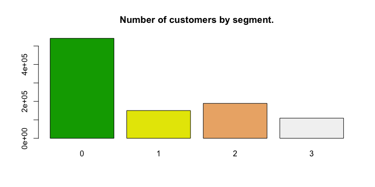
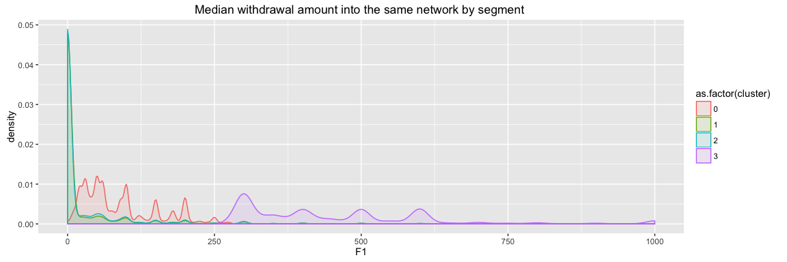
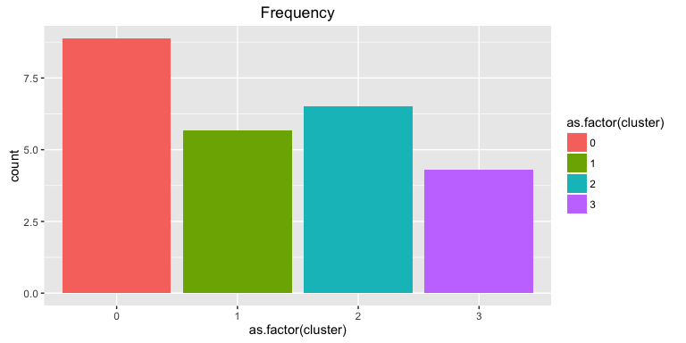

Data integration
================
12 de junio de 2016

The last process before analyze and visualize the results is to integrate all the data sets.

In this phase we query, transform, group, summarize and merge information in several ways to create two datasets. The first one will hold client data and the second withdrawl data.

**Reading data**

In the first step we read the original dataset and the results obtained from running the clustering algorithm

A quick plot to check how many users where assigned to each segment.

``` r
# Number of clients by cluster
barplot(table(DT.r$cluster), main="Number of customers by segment.",  col=terrain.colors(4))
```



``` r
# Load not scaled variables
DT.c <- readRDS("./data/DTc.rds")

# Add the cluster variable to scaled data frame
DT.clients <- merge(
  DT.c, 
  DT.r[,c("PER_ID_PERSONA", "cluster"), with = FALSE], 
  by=c('PER_ID_PERSONA')
)

# Calculate the median for each variable by cluster
cluster_medians.df <- aggregate(DT.clients[, 2:7, with = FALSE], by = list(DT.clients$cluster), median)

write.table(cluster_medians.df, file.path('data/cluster_medians.csv'), row.names = F, col.names = TRUE, sep=",")

# Calculate the mean for each variable by cluster
setDT(DT.clients)
cluster_means.df <- DT.clients[, lapply(.SD, mean, na.rm=TRUE), by=list(DT.clients$cluster), .SDcols=c(2:7) ][order(DT.clients)]
cluster_means.df
```

    ##    DT.clients        F1         F2         F3        F4         F5
    ## 1:          0  87.42946   1.688919   2.525916 1.7822123 0.04703892
    ## 2:          1  26.86719 116.261664  32.485884 0.2112874 1.53087035
    ## 3:          2  28.92897   9.828363 149.377057 0.2467102 0.23185504
    ## 4:          3 467.07228   1.556532   4.388723 1.7393149 0.02274477
    ##            F6
    ## 1: 0.05316255
    ## 2: 0.30213733
    ## 3: 1.49150796
    ## 4: 0.03555588

``` r
write.table(cluster_means.df, file.path('data/cluster_means.csv'), row.names = F, col.names = TRUE, sep=",")

p1 <- ggplot(DT.clients, aes(F1, ..density.., fill = as.factor(cluster), colour = as.factor(cluster))) +
  geom_density(alpha = 0.1) +
  xlim(0, 1000)  + 
  ggtitle("Median withdrawal amount into the same network by segment ")
```

Mean and median values for each cluster:

|  Group.1|   F1|   F2|   F3|   F4|   F5|   F6|
|--------:|----:|----:|----:|----:|----:|----:|
|        0|   60|    0|    0|    2|    0|    0|
|        1|    0|   70|    0|    0|    2|    0|
|        2|    0|    0|  100|    0|    0|    1|
|        3|  400|    0|    0|    2|    0|    0|

<table style="width:111%;">
<colgroup>
<col width="16%" />
<col width="15%" />
<col width="16%" />
<col width="16%" />
<col width="15%" />
<col width="15%" />
<col width="15%" />
</colgroup>
<thead>
<tr class="header">
<th align="right">DT.clients</th>
<th align="right">F1</th>
<th align="right">F2</th>
<th align="right">F3</th>
<th align="right">F4</th>
<th align="right">F5</th>
<th align="right">F6</th>
</tr>
</thead>
<tbody>
<tr class="odd">
<td align="right">0</td>
<td align="right">87.42946</td>
<td align="right">1.688919</td>
<td align="right">2.525917</td>
<td align="right">1.7822123</td>
<td align="right">0.0470389</td>
<td align="right">0.0531626</td>
</tr>
<tr class="even">
<td align="right">1</td>
<td align="right">26.86719</td>
<td align="right">116.261664</td>
<td align="right">32.485884</td>
<td align="right">0.2112874</td>
<td align="right">1.5308704</td>
<td align="right">0.3021373</td>
</tr>
<tr class="odd">
<td align="right">2</td>
<td align="right">28.92897</td>
<td align="right">9.828363</td>
<td align="right">149.377057</td>
<td align="right">0.2467102</td>
<td align="right">0.2318550</td>
<td align="right">1.4915080</td>
</tr>
<tr class="even">
<td align="right">3</td>
<td align="right">467.07228</td>
<td align="right">1.556532</td>
<td align="right">4.388723</td>
<td align="right">1.7393149</td>
<td align="right">0.0227448</td>
<td align="right">0.0355559</td>
</tr>
</tbody>
</table>

A sample visualization to check the differences among clusters:

    ## Warning: Removed 1198 rows containing non-finite values (stat_density).



**New features**

To gain more insights form data we created some new variables to apply a RFM analysis of the users and get better knowledge from them.

``` r
# RFM

# Create a new varible with the days from the previous transaction for each user
DT[, DIAS_DESDE_ULT_OPER := as.numeric(difftime(time1 = max(FECHA), time2 = FECHA, units = "days"))]

# Users withdraw funds every 42 days, and 50% of them made it between 21 and 63 days
summary(DT$DIAS_DESDE_ULT_OPER)
```

    ##    Min. 1st Qu.  Median    Mean 3rd Qu.    Max. 
    ##    0.00   21.00   42.00   42.53   63.00   90.00

``` r
# New variables with recency, frequency and monetary value for each user
DT.rfm <- DT[, list( RECENCIA = min(DIAS_DESDE_ULT_OPER),
                     FRECUENCIA = unique(.N),
                     VALOR_MEDIO = median(IMPOPER, na.rm = T)
)
,by=.(PER_ID_PERSONA)]

# Merge the new variables with our clients data frame
DT.clients <- merge(
  DT.clients, 
  DT.rfm, 
  by=c('PER_ID_PERSONA')
)

p3 <- ggplot(DT.clients[,mean(RECENCIA, na.rm = T),by=.(cluster)], aes(x= as.factor(cluster), fill=as.factor(cluster))) + geom_bar() + stat_summary_bin(aes(y = V1), fun.y = "mean", geom = "bar") + ggtitle('Recency')
p4 <- ggplot(DT.clients[,mean(FRECUENCIA, na.rm = T),by=.(cluster)], aes(x= as.factor(cluster), fill=as.factor(cluster))) + geom_bar() + stat_summary_bin(aes(y = V1), fun.y = "mean", geom = "bar") + ggtitle('Frequency')
p5 <- ggplot(DT.clients[,mean(VALOR_MEDIO, na.rm = T),by=.(cluster)], aes(x= as.factor(cluster), fill=as.factor(cluster))) + geom_bar() + stat_summary_bin(aes(y = V1), fun.y = "mean", geom = "bar") + ggtitle('Average withdrawal amount')
```

**Visualizing recency, frequency and average withdrawal amount**

The next three plot let us easily inspect the different behaviour among user in each segment.



**New features**

``` r
# Calculating user age and account duration
DT.clients <- merge(
  DT.clients,
  DT[!duplicated(DT$PER_ID_PERSONA), list(
    PER_ANTIGUEDAD = round(julian(as.Date(Sys.Date()), as.Date(PER_FECHA_ALTA))/365.25, 0),
    PER_EDAD = round(julian(as.Date(Sys.Date()), as.Date(PER_FECHA_NAC))/365.25,0) 
  ), by = .(PER_ID_PERSONA)],
  by=c('PER_ID_PERSONA')
)

p6 <- ggplot(DT.clients[,mean(PER_EDAD, na.rm = T),by=.(cluster)], aes(x= as.factor(cluster), y=V1, fill=as.factor(cluster))) + geom_bar(stat = "identity") + ggtitle("Average user age by segment")
```


``` r
# Adding user information
DT.clients <- merge(
  DT.clients, 
  DT[!duplicated(DT$PER_ID_PERSONA),c("PER_ID_PERSONA", "PER_ID_SEXO", "PER_EST_CIVIL", "PER_COD_PAIS_NAC"), with = FALSE], 
  by=c('PER_ID_PERSONA')
)
```

``` r
# Derive new variables from the original ones for better undestanding of each cluster

client_means.df <- as.data.frame(DT.clients[, lapply(.SD, mean, na.rm=TRUE), by=list(DT.clients$cluster), .SDcols=c(9:11,13) ][order(DT.clients)])

head(DT.clients, 2)
```

    ##          PER_ID_PERSONA F1 F2 F3 F4 F5 F6 cluster RECENCIA FRECUENCIA
    ## 1: 00005E5DRZUPAFFA7H0C 60  0  0  2  0  0       0       28          4
    ## 2: 0003QV0VUJPM1GO20U4O  0  0 80  0  0  2       2        8         13
    ##    VALOR_MEDIO PER_ANTIGUEDAD PER_EDAD PER_ID_SEXO PER_EST_CIVIL
    ## 1:          60              5       57           F             S
    ## 2:          80              2       33           F             S
    ##    PER_COD_PAIS_NAC
    ## 1:              MEX
    ## 2:              ESP

``` r
# Export the result for data visualization in Tableu
write.table(client_means.df, file.path('data/tableau_rfm.csv'), row.names = F, col.names = TRUE, sep=",")

# Export client data for visualization in Tableu
write.table(DT.clients, file.path('data/tableau_clients.csv'), row.names = F, col.names = TRUE, sep=",")
```

**Mean recency, frequency, amount and user age by cluster**

|  DT.clients|  RECENCIA|  FRECUENCIA|  VALOR\_MEDIO|  PER\_EDAD|
|-----------:|---------:|-----------:|-------------:|----------:|
|           0|  16.17724|    8.881618|      87.54917|   45.73454|
|           1|  24.78353|    5.663530|     110.02601|   41.42304|
|           2|  21.78846|    6.500578|     137.02217|   42.54709|
|           3|  21.35347|    4.308924|     458.71915|   54.69223|

Withdrawal data
---------------

``` r
# Add user cluster assignment to each operation
DT.transactons <- merge(
  DT, 
  DT.r[,c("PER_ID_PERSONA", "cluster"), with = FALSE], 
  by=c('PER_ID_PERSONA')
)

barplot(table(DT.transactons$cluster), main= "Number of withdrowals by segment ",  col=terrain.colors(4))
```


``` r
head(DT.transactons, 2)
```

    ##          PER_ID_PERSONA      FECHA  ANO MES DIA OP_ADQUIRENTE  ADQUIERENTE
    ## 1: 00005E5DRZUPAFFA7H0C 2016-01-08 2016  01  08          1066 Entidad 1016
    ## 2: 00005E5DRZUPAFFA7H0C 2016-01-14 2016  01  14          1066 Entidad 1016
    ##    DES_TIPO_ADQUIRENTE            OP_EMISOR               EMISOR
    ## 1:           EURO 6000 CM8GMN7BQOF9JJ1XXCPE KSPHEXET1G2LNR4OXAGU
    ## 2:           EURO 6000 CM8GMN7BQOF9JJ1XXCPE KSPHEXET1G2LNR4OXAGU
    ##    DES_TIPO_EMISOR DES_AMBITO    OP_IDENT_TERMINAL OP_COD_POST_COMERCIO
    ## 1:       EURO 6000      On us K4T6IAI4DWU3C8YF26M5                99999
    ## 2:       EURO 6000      On us K4T6IAI4DWU3C8YF26M5                99999
    ##    DES_PROVINCIA LOCALIDAD OP_COD_PAIS_COMERCIO  DES_MARCA DES_GAMA
    ## 1:            NA        NA                  ESP MasterCard Estándar
    ## 2:            NA        NA                  ESP MasterCard Estándar
    ##    DES_PRODUCTO TIPO_TARJETA DES_CREDEB DES_CLASE_OPERACION DES_PAGO
    ## 1:   MasterCard            P    Crédito          Reintegros Diferido
    ## 2:   MasterCard            P    Crédito          Reintegros Diferido
    ##    DES_RESULTADO PER_TIPO_PERS PER_FECHA_ALTA OF_COD_POST PER_COD_PAIS_NAC
    ## 1:            OK             E     2011-03-28       23200              MEX
    ## 2:            OK             E     2011-03-28       23200              MEX
    ##    OF_COD_PAIS_RES PER_ID_SEXO PER_EST_CIVIL PER_MARCA_EMP PER_MARCA_FALL
    ## 1:             ESP           F             S             0              0
    ## 2:             ESP           F             S             0              0
    ##    PER_FECHA_NAC NOPER IMPOPER DIAS_DESDE_ULT_OPER cluster
    ## 1:    1959-12-05     1      60                  83       0
    ## 2:    1959-12-05     1      10                  77       0

``` r
# Export withdrawals data for visualization in Tableu
# write.table(DT.transactons, file.path('data/tableau_operaciones.csv'), row.names = F, col.names = TRUE, sep=",")
```
