Exploratory Data Analysis
================

In this first phase of the data science project we performed an exploratory data analysis to:

-   maximize insight into the data set
-   detect outliers and missing data
-   extract important variables
-   test underlying assumptions
-   develop a testing model and evualate all the requisites to run it.

We applyed quite simple graphical techniques like:

-   plotting the raw data
-   plotting simple statistics

We used R base plotting functionality because of it's convenience, but complimented with the use of `ggplot2` and `lattice` R packages.

For data wrangling tasks we used the power of the `data.table` package.

> The EDA analysis was based on a subsample of 100000 observations from the original data set. The data was partitioned running `subsample -n 100000 datos.csv -r > sample.csv` on the operating system shell.

``` r
knitr::opts_chunk$set(echo = TRUE,fig.align='center')

list.of.packages <- c("data.table", "dplyr","ggplot2","lubridate","lattice","scales","corrplot","caret","cluster","useful","viridis","ggthemes","knitr")
new.packages <- list.of.packages[!(list.of.packages %in% installed.packages()[,"Package"])]
if(length(new.packages)) install.packages(new.packages)
```

Loading data
------------

``` r
file <- file.path('data/sample.csv')

if (file.exists(file)) {
  cat('Reading', file)
  print(paste(round(file.info(file)$size  / 2^30, 4), 'gigabytes'))
  readLines(file, n=2, skipNul = T)
  DT <- fread(file, encoding='Latin-1', na.strings=c("","NA"))
} else {
  stop("File not found.")
}
```

    ## Reading data/sample.csv[1] "0.0167 gigabytes"

The dataset data/sample.csv contains 50000 withdrawal requests by 33466 users. User data is missing for 15399 requests, that is, a 30.798% of the data set.

Data Type Conversion
--------------------

**Dates:**

``` r
sapply(DT,class)
```

    ##                  ANO                  MES                  DIA 
    ##          "character"          "character"          "character" 
    ##        OP_ADQUIRENTE          ADQUIERENTE  DES_TIPO_ADQUIRENTE 
    ##          "character"          "character"          "character" 
    ##            OP_EMISOR               EMISOR      DES_TIPO_EMISOR 
    ##          "character"          "character"          "character" 
    ##           DES_AMBITO    OP_IDENT_TERMINAL OP_COD_POST_COMERCIO 
    ##          "character"          "character"          "character" 
    ##        DES_PROVINCIA            LOCALIDAD OP_COD_PAIS_COMERCIO 
    ##          "character"          "character"          "character" 
    ##            DES_MARCA             DES_GAMA         DES_PRODUCTO 
    ##          "character"          "character"          "character" 
    ##         TIPO_TARJETA           DES_CREDEB  DES_CLASE_OPERACION 
    ##          "character"          "character"          "character" 
    ##             DES_PAGO        DES_RESULTADO       PER_ID_PERSONA 
    ##          "character"          "character"          "character" 
    ##        PER_TIPO_PERS       PER_FECHA_ALTA          OF_COD_POST 
    ##          "character"          "character"          "character" 
    ##     PER_COD_PAIS_NAC      OF_COD_PAIS_RES          PER_ID_SEXO 
    ##          "character"          "character"          "character" 
    ##        PER_EST_CIVIL        PER_MARCA_EMP       PER_MARCA_FALL 
    ##          "character"          "character"          "character" 
    ##        PER_FECHA_NAC                NOPER              IMPOPER 
    ##          "character"          "character"          "character"

``` r
DT[,FECHA:=as.Date(paste(ANO, MES, DIA, sep="-" ), tz = "Europe/Madrid")]  
DT[,PER_FECHA_NAC:=as.Date(PER_FECHA_NAC, format = "%Y%m%d", tz = "Europe/Madrid")] 
DT[,PER_FECHA_ALTA:=as.Date(PER_FECHA_ALTA, format = "%Y%m%d", tz = "Europe/Madrid")]   
```

**Categorical variables:**

``` r
variables <- c('ANO','MES','DIA','OP_ADQUIRENTE','DES_TIPO_EMISOR','DES_PROVINCIA', 'DES_TIPO_ADQUIRENTE', 'DES_AMBITO',   'OP_COD_PAIS_COMERCIO','DES_MARCA','DES_GAMA','DES_PRODUCTO', 'TIPO_TARJETA', 'DES_CREDEB','DES_CLASE_OPERACION',       'DES_PAGO','DES_RESULTADO','PER_TIPO_PERS','PER_COD_PAIS_NAC', 'OF_COD_PAIS_RES','PER_ID_SEXO','PER_EST_CIVIL','PER_MARCA_EMP','PER_MARCA_FALL')
DT[,(variables):=lapply(.SD, as.factor),.SDcols=variables]
rm(variables)
```

**Numerical variables:**

``` r
variables <- c('NOPER','IMPOPER')
DT[,(variables):=lapply(.SD, as.numeric),.SDcols=variables]
```

    ## Warning in lapply(.SD, as.numeric): NAs introducidos por coerción

``` r
rm(variables)
```

**Reordering columns**

``` r
setcolorder(DT, c(ncol(DT), 1:(ncol(DT)-1)))
```

**Inspecting firs row of the data set:**

| FECHA      | ANO  | MES | DIA | OP\_ADQUIRENTE       | ADQUIERENTE          | DES\_TIPO\_ADQUIRENTE | OP\_EMISOR           | EMISOR               | DES\_TIPO\_EMISOR | DES\_AMBITO | OP\_IDENT\_TERMINAL  | OP\_COD\_POST\_COMERCIO | DES\_PROVINCIA         | LOCALIDAD | OP\_COD\_PAIS\_COMERCIO | DES\_MARCA | DES\_GAMA | DES\_PRODUCTO       | TIPO\_TARJETA | DES\_CREDEB | DES\_CLASE\_OPERACION | DES\_PAGO | DES\_RESULTADO | PER\_ID\_PERSONA     | PER\_TIPO\_PERS | PER\_FECHA\_ALTA | OF\_COD\_POST | PER\_COD\_PAIS\_NAC | OF\_COD\_PAIS\_RES | PER\_ID\_SEXO | PER\_EST\_CIVIL | PER\_MARCA\_EMP | PER\_MARCA\_FALL | PER\_FECHA\_NAC |  NOPER|  IMPOPER|
|:-----------|:-----|:----|:----|:---------------------|:---------------------|:----------------------|:---------------------|:---------------------|:------------------|:------------|:---------------------|:------------------------|:-----------------------|:----------|:------------------------|:-----------|:----------|:--------------------|:--------------|:------------|:----------------------|:----------|:---------------|:---------------------|:----------------|:-----------------|:--------------|:--------------------|:-------------------|:--------------|:----------------|:----------------|:-----------------|:----------------|------:|--------:|
| 2016-03-06 | 2016 | 03  | 06  | BM3MV1QJ1RWI6XB8W36S | Q4SRXYQNPFB8ST2BCSLT | EURO 6000             | X4W6L75KAK6TKQFMYXGJ | T08GEJ1FFLLW5WK82Z0M | EURO 6000         | On us       | SQ09U117VFP20L0PA5EV | 99999                   | NO EXISTE LA PROVINCIA | NA        | ESP                     | Visa       | Estándar  | Electron/Plus/V Pay | P             | Débito      | Reintegros            | Debito    | OK             | 4INJUF8D4XYIP4XXWDJR | F               | 1993-12-18       | 24385         | ESP                 | ESP                | M             | S               | 0               | 0                | 1987-01-13      |      1|      400|

Exploratory data analysis
-------------------------

**Missing data**

``` r
par(mai=c(1,1.6,1,0.5), family = "Helvetica", col=viridis(1), fg = "black")
barplot(sapply(DT, function(x) sum(is.na(x))), main = "Missing Data", col=viridis(1), xlab = "Count", cex.names = .6, horiz=TRUE,las=1, border = "white")
```

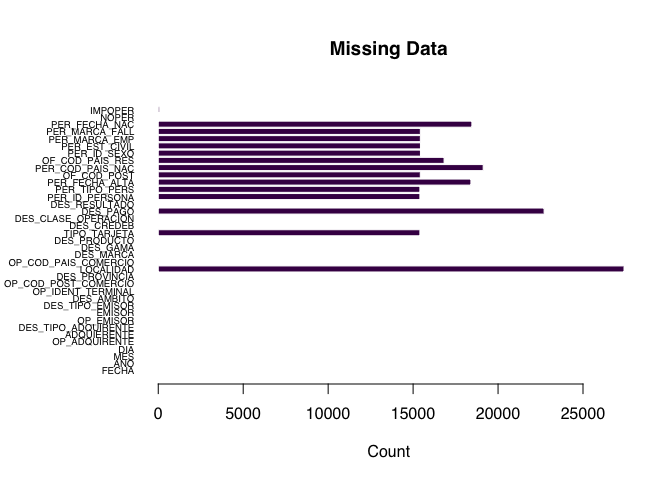

### Trying to figure out what the data set "looks" like

**Bank companies**

The dataset contains requests from users of 70 diferent bank companies.

We decided to change anonymized names by friendly ones:

``` r
setkey(DT,OP_ADQUIRENTE)

op_adquiriente <- seq(from = 1000, to=length(unique(DT$OP_ADQUIRENTE))+999, by =1)
DT[,OP_ADQUIRENTE:=factor(OP_ADQUIRENTE,labels=op_adquiriente)]

adquirente <- paste("Entidad", op_adquiriente)
DT[,ADQUIERENTE:=factor(ADQUIERENTE,labels=adquirente)]

knitr::kable(head(DT[,c('ADQUIERENTE','OP_ADQUIRENTE'), with = FALSE]))
```

| ADQUIERENTE  | OP\_ADQUIRENTE |
|:-------------|:---------------|
| Entidad 1027 | 1000           |
| Entidad 1027 | 1000           |
| Entidad 1027 | 1000           |
| Entidad 1027 | 1000           |
| Entidad 1027 | 1000           |
| Entidad 1027 | 1000           |

**Monthly withdrawls**

``` r
barplot(table(DT$MES), main = "Monthly withdrawls", xlab = "Mes", col=viridis(3), border = "white")
```

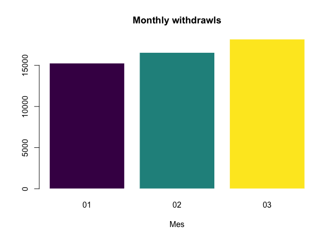

**Daily withdrawls**

``` r
counts <- table(DT$MES, DT$DIA)
barplot(counts, col=viridis(3),  main = "Daily withdrawls by month", xlab = "Month", sub="February was in 2016 only 29 days long", legend = c("January","February","March"), border = "white")
```

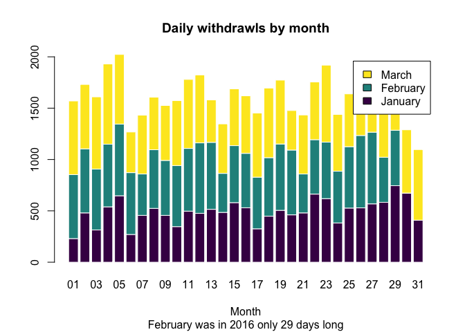

``` r
rm(counts)
```

**Withdrawls by weekday**

``` r
counts <- table(DT$MES, lubridate::wday(DT$FECHA, label = T))
barplot(counts, col=viridis(3),  main = "Withdrawls by weekday", xlab = "Weekday", sub="Num of withdrawls are bigger on weekends", legend = c("January","February","March"), border = "white")
```

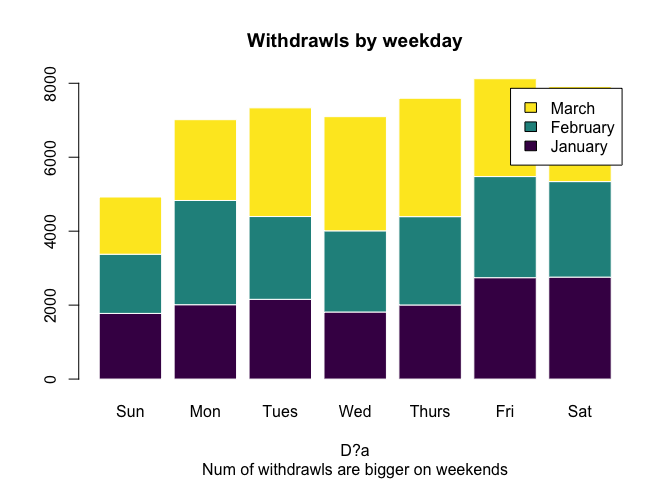

``` r
rm(counts)
```

**Withdrawl amount**

``` r
hist(log(DT$IMPOPER), col=viridis(1), main = "Withdrawl amount", border = "white")
```

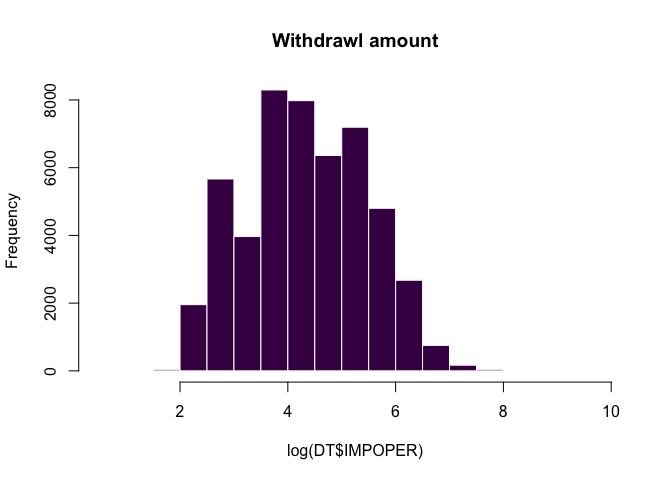

**Missing values**

54.266 of observations do not have province:

``` r
par(las=2)
par(mar=c(5,12,4,2))
barplot(table(DT$DES_PROVINCIA), horiz=TRUE, cex.names=0.6, col=viridis(1),  main = "Withdrawls by province", xlab = "D?a", sub="Many withdrawls without informed province", border = NA)
```

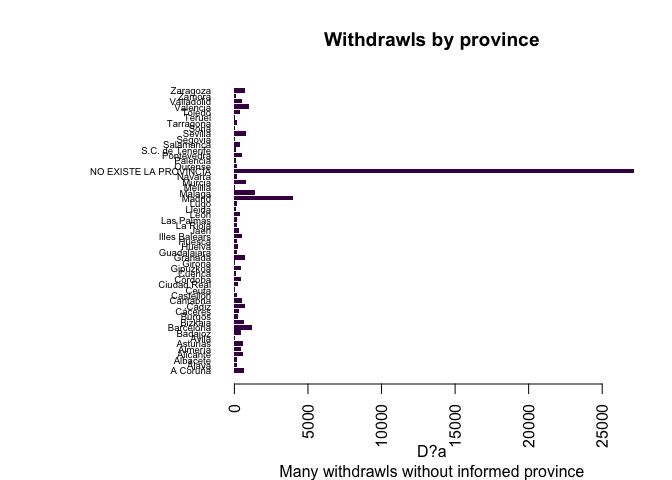

``` r
# Assign NA to missing data
levels(DT$DES_PROVINCIA)[levels(DT$DES_PROVINCIA)=='NO EXISTE LA PROVINCIA'] <- NA
```

**Withdrawls requests**

``` r
barplot(table(DT$NOPER), col=viridis(10), border = NA, main="Frecuency of withdrawls requests")
```

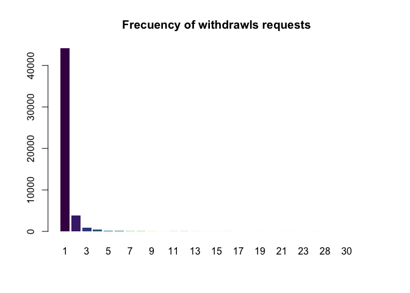

**Withdrawls by user age**

``` r
par(mar=c(5,5,5,5))
counts <- table(year(Sys.Date())-year(DT$PER_FECHA_NAC))
barplot(counts, col=viridis(1),  main = "Withdrawls by user age", xlab = "Age", sub="", border = NA )
```

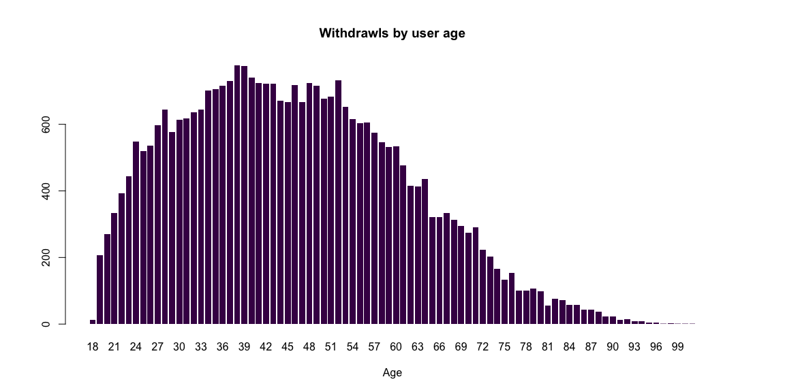

``` r
rm(counts)
```

**Withdrawls requests by age and weekday**

``` r
histogram(~ year(Sys.Date())-year(DT$PER_FECHA_NAC) | wday(DT$FECHA, label = T), data=DT, xlab = "Age", main="Withdrawls requests by age and weekday", col=viridis(14), par.settings = list(strip.background=list(col="white")), border = "white" )
```

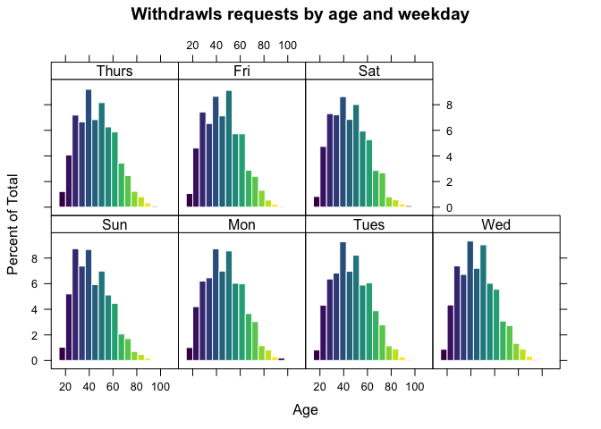

**Withdrawal amount requests by type** Amount variable has been transformed into *logarithm* to reduce the effect of outliers.

``` r
ggplot(DT) + geom_density(aes(x=IMPOPER, fill = DES_CREDEB), alpha = 1) + scale_x_log10(breaks=c(10,100,200,2000), labels=comma) + annotation_logticks(sides="bt") + facet_wrap(~ DES_CREDEB)  + scale_fill_viridis(discrete=T) + labs(x=NULL, y=NULL, title="Withdrawal (log) amount requests by type") + theme_tufte(base_family="Helvetica") + theme(axis.ticks=element_blank()) + theme(axis.text=element_text(size=10)) + theme(legend.title=element_text(size=8)) + theme(legend.text=element_text(size=6)) + theme(plot.title=element_text(hjust=0))
```

    ## Warning: Removed 86 rows containing non-finite values (stat_density).

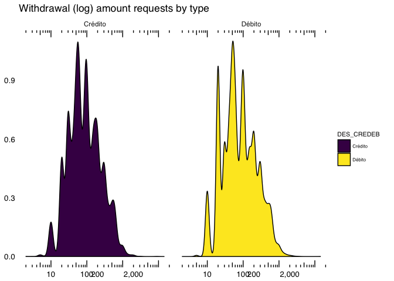

**Total withdrawls requests by user**

``` r
counts <- table(DT[!is.na(PER_ID_PERSONA),sum(NOPER), by = .(PER_ID_PERSONA)]$V1)
barplot(counts, col=viridis(1),  main = "Total withdrawls requests by user", xlab = "Withdrawls requests", ylab = "Users", sub="", border = "white")
```

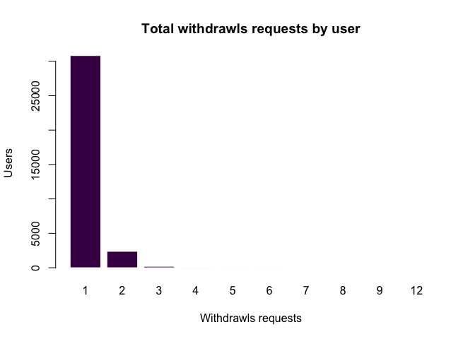

``` r
rm(counts)
```

**Mean withdrawls requests by user**

``` r
counts <- table(DT[!is.na(PER_ID_PERSONA),mean(na.omit(.N)), by = .(PER_ID_PERSONA)]$V1)
barplot(counts, col=viridis(4),  main = "Mean withdrawls requests by user", xlab = "Mean withdrawls requests", sub="", border = "white")
```

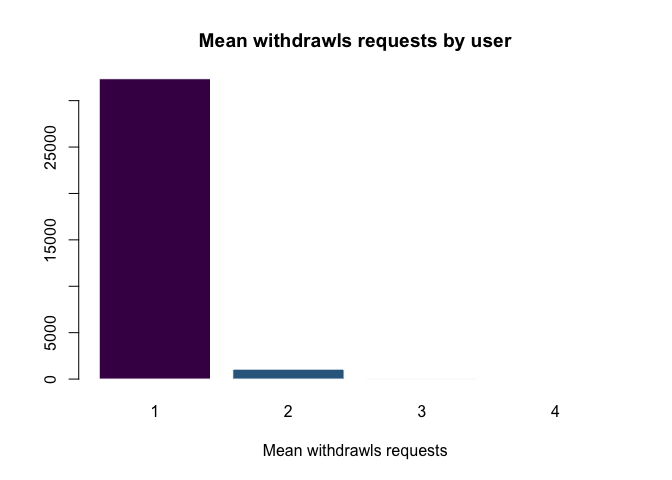

``` r
rm(counts)
```

**Mean monthly withdrawls requests by user**

``` r
counts <- table(DT[!is.na(PER_ID_PERSONA),mean(na.omit(.N)), by = .(PER_ID_PERSONA, MES)]$V1)
barplot(counts, col=viridis(3),  main = "Mean monthly withdrawls requests by user", xlab = "Mean withdrawls requests", sub="", border = "white")
```

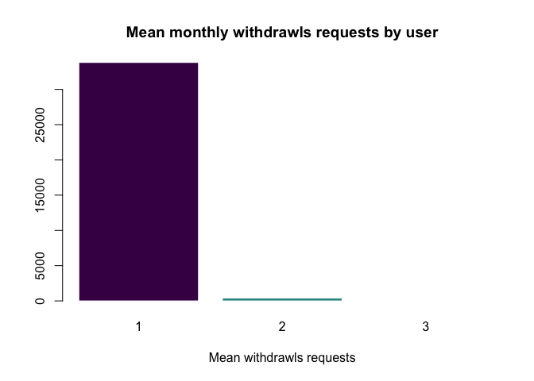

``` r
rm(counts)
```

**Withdrawls requests by its scope**

``` r
barplot(table(DT$DES_AMBITO), col=viridis(5), cex.names=0.6, main = "Withdrawls requests by scope", border = "white", horiz = F)
```

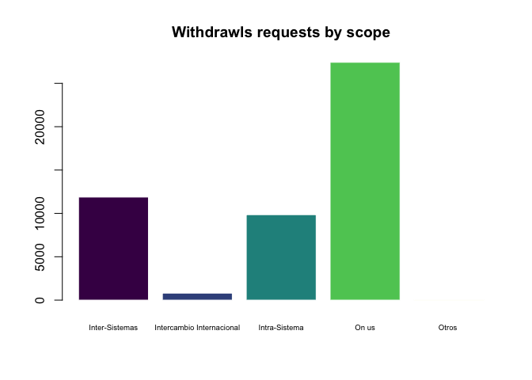

*On Us requests show withdrawls made by clients off a bank company in ATMs owned by the same company. *Inter-Sistema requests show operations between different bank companies but into the ¡ir own system (EURO 6000, Servired or 4B) *Intra-Sistema shows requests between different bank companies in different systems *Internacionales shows request between bank companies from different countries

**Monthly withdrawls requests by its scope**

``` r
counts <- table(DT$MES, DT$DES_AMBITO)
barplot(counts, col=viridis(3), cex.names=0.6, main = "Monthly withdrawls requests by its scope", xlab = "Scope", sub="", legend = c("January","February","March"), border = "white")
```

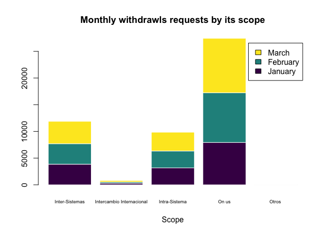

``` r
rm(counts)
```

#### Payments types

94.8% of requests are direct debit.

**Withdrawls requests by its payment type**

``` r
counts <- table(DT$MES, DT$DES_PAGO)
barplot(counts, col=viridis(3),  main = "Withdrawls requests by its payment type", xlab = "Payment types", sub="", legend = c("January","February","March"), border = "white")
```

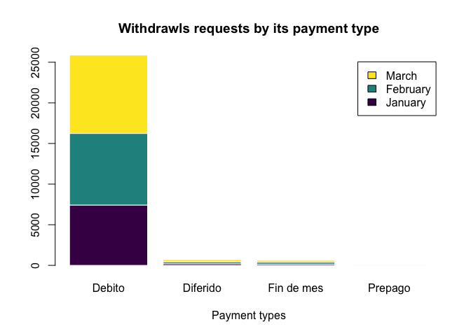

``` r
rm(counts)
```

**Mean withdrawl amount by payment type**

``` r
DT[,mean(na.omit(IMPOPER)), by = .(DES_PAGO, MES)] %>% ggplot(aes(x = DES_PAGO, y = V1, fill= MES)) + geom_bar(stat="identity", position="dodge", colour="white") + scale_fill_viridis(discrete=T) + labs(x=NULL, y=NULL, title="Mean withdrawl amount by payment type") + theme_tufte(base_family="Helvetica") + theme(axis.ticks=element_blank()) + theme(axis.text=element_text(size=10)) + theme(legend.title=element_text(size=8)) + theme(legend.text=element_text(size=6)) + theme(plot.title=element_text(hjust=0))
```

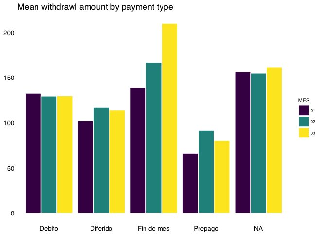

``` r
sum(na.omit(DT$IMPOPER))
```

    ## [1] 7146569

**Total withdrawl amount by payment type**

``` r
DT[,sum(na.omit(IMPOPER)), by = .(DES_PAGO, MES)] %>% ggplot(aes(x = DES_PAGO, y = V1, fill= MES)) + geom_bar(stat="identity", position="dodge", colour="white") + scale_fill_viridis(discrete=T) + labs(x=NULL, y=NULL, title="Total withdrawl amount by payment type") + theme_tufte(base_family="Helvetica") + theme(axis.ticks=element_blank()) + theme(axis.text=element_text(size=10)) + theme(legend.title=element_text(size=8)) + theme(legend.text=element_text(size=6)) + theme(plot.title=element_text(hjust=0))
```

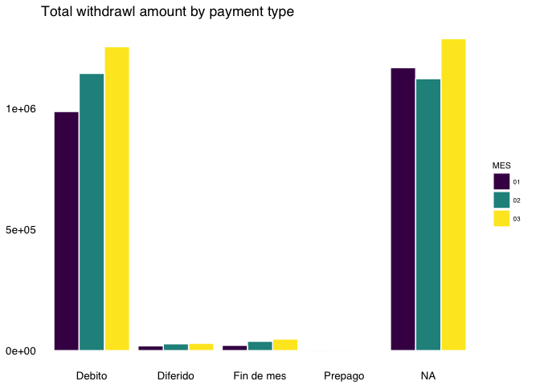

There are 86 requests without amount data, a 0.172% of the full data set.

#### Spanish provinces

``` r
levels(DT$DES_PROVINCIA)[levels(DT$DES_PROVINCIA)=='NO EXISTE LA PROVINCIA'] <- NA
```

There are 27133 observations without informed province, a 54.3% of the data set.

**Total withdrawls by province**

``` r
DT[!is.na(DES_PROVINCIA), (.N), by = DES_PROVINCIA] %>% ggplot(aes(x = DES_PROVINCIA, y = V1, fill= V1)) + geom_bar(stat="identity", colour="white") + coord_flip() + scale_fill_viridis(discrete=F) + labs(x=NULL, y=NULL, title="Total withdrawls by province") + theme_tufte(base_family="Helvetica") + theme(axis.ticks=element_blank()) + theme(axis.text=element_text(size=10)) + theme(legend.title=element_text(size=8)) + theme(legend.text=element_text(size=6)) + theme(plot.title=element_text(hjust=0))
```

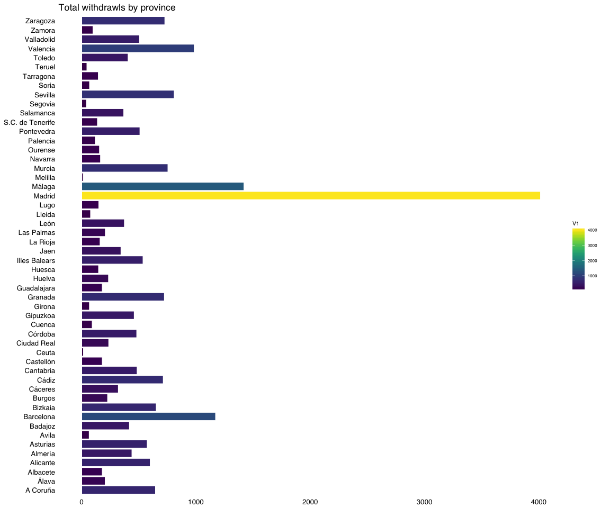

**Total withdrawls by province: EURO 6000**

``` r
DT[!is.na(DES_PROVINCIA) & DES_TIPO_EMISOR == 'EURO 6000', .N, by = .(DES_PROVINCIA, DES_TIPO_EMISOR)] %>% ggplot(aes(x = DES_PROVINCIA, y = N, fill = N)) + geom_bar(stat="identity", colour="white") + coord_flip() + scale_fill_viridis(discrete=F) + labs(x=NULL, y=NULL, title="Total withdrawls by  province (Red EURO 6000)") + theme_tufte(base_family="Helvetica") + theme(axis.ticks=element_blank()) + theme(axis.text=element_text(size=10)) + theme(legend.title=element_text(size=8)) + theme(legend.text=element_text(size=6)) + theme(plot.title=element_text(hjust=0))
```

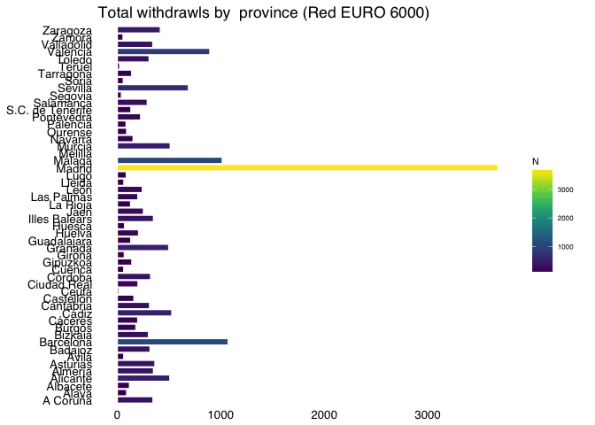

**Total withdrawls by payment province: No EURO 6000**

``` r
DT[!is.na(DES_PROVINCIA) & DES_TIPO_EMISOR != 'EURO 6000', .N, by = .(DES_PROVINCIA, DES_TIPO_EMISOR)] %>% ggplot(aes(x = DES_PROVINCIA, y = N, fill = DES_TIPO_EMISOR)) + geom_bar(stat="identity") + coord_flip() + scale_fill_viridis(discrete=T) + labs(x=NULL, y=NULL, title="Total withdrawls by  province (No EURO 6000)") + theme_tufte(base_family="Helvetica") + theme(axis.ticks=element_blank()) + theme(axis.text=element_text(size=10)) + theme(legend.title=element_text(size=8)) + theme(legend.text=element_text(size=6)) + theme(plot.title=element_text(hjust=0))
```

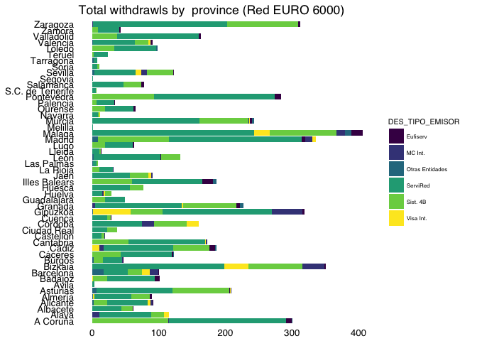

Feature engineering
-------------------

Using domain knowledge of the provided data set, new variables where derived according to the main goal of this analysis.

``` r
# Remove no sucessfull requests and request with no user information provided
DT2 <- DT[!is.na(PER_ID_PERSONA) & DES_RESULTADO == "OK"]
rm(DT)

setkeyv(DT2,c("PER_ID_PERSONA","MES"))
DT2 <- DT2[, list(F1=median(na.omit(IMPOPER[which(DES_AMBITO == "On us")])),
                  F2=median(na.omit(IMPOPER[which(DES_AMBITO == "Inter-Sistemas")])),
                  F3=median(na.omit(IMPOPER[which(DES_AMBITO == "Intra-Sistema")]), na.rm = T),
                  F4=length(unique(.N[which(DES_AMBITO == "On us")])),
                  F5=length(unique(.N[which(DES_AMBITO == "Inter-Sistemas")])),
                  F6=length(unique(.N[which(DES_AMBITO == "Intra-Sistema")])),
                  F7=length(.N[which(DES_CREDEB == "Débito")]),
                  F8=length(.N[which(DES_CREDEB == "Crédito")]),
                  F9=sum(IMPOPER[which(DES_CREDEB == "Débito")], na.rm = T) / length(unique(MES)), 
                  F10=sum(IMPOPER[which(DES_CREDEB == "Crédito")], na.rm = T) / length(unique(MES))
                  
),
by=.(PER_ID_PERSONA)]

barplot(sapply(DT2[,c(2:11), with= FALSE], function(x) sum(is.na(x))), main = "Missing data by variable", col=viridis(10), xlab = "Count", cex.names = .6, horiz=F,las=1, border = "white")
```

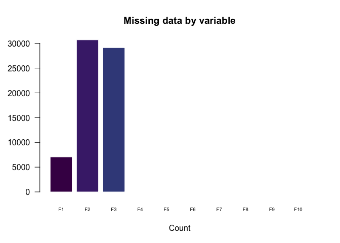

``` r
DT2[is.na(DT2)] <- 0

knitr::kable(head(DT2, 2))
```

| PER\_ID\_PERSONA     |   F1|   F2|   F3|   F4|   F5|   F6|   F7|   F8|   F9|  F10|
|:---------------------|----:|----:|----:|----:|----:|----:|----:|----:|----:|----:|
| 002JN2ZPCA9DPVUE1Q7P |   70|    0|    0|    1|    0|    0|    1|    0|   70|    0|
| 0034SFJMXSQT5WX8QXY1 |  450|    0|    0|    1|    0|    0|    1|    0|  450|    0|

**Removing high correlated variables:**

Highly correlated variables usually measure the same kind of information in different ways. Many algorithms may fail of give strange results if present.

``` r
DT3 <- as.data.frame(DT2)
row.names(DT3) <- DT3$PER_ID_PERSONA
DT3$PER_ID_PERSONA <- NULL

correlation.mat <-cor(DT3)
knitr::kable(round(correlation.mat,2))
```

|     |     F1|     F2|     F3|     F4|     F5|     F6|     F7|     F8|     F9|    F10|
|-----|------:|------:|------:|------:|------:|------:|------:|------:|------:|------:|
| F1  |   1.00|  -0.12|  -0.15|   0.30|  -0.19|  -0.24|  -0.05|   0.04|   0.61|   0.45|
| F2  |  -0.12|   1.00|  -0.04|  -0.33|   0.61|  -0.07|   0.01|  -0.01|   0.14|   0.04|
| F3  |  -0.15|  -0.04|   1.00|  -0.43|  -0.07|   0.61|  -0.02|   0.02|   0.21|   0.15|
| F4  |   0.30|  -0.33|  -0.43|   1.00|  -0.53|  -0.68|   0.08|   0.05|   0.00|   0.02|
| F5  |  -0.19|   0.61|  -0.07|  -0.53|   1.00|  -0.11|   0.03|  -0.03|  -0.01|  -0.04|
| F6  |  -0.24|  -0.07|   0.61|  -0.68|  -0.11|   1.00|  -0.01|   0.02|   0.01|   0.02|
| F7  |  -0.05|   0.01|  -0.02|   0.08|   0.03|  -0.01|   1.00|  -0.93|   0.37|  -0.53|
| F8  |   0.04|  -0.01|   0.02|   0.05|  -0.03|   0.02|  -0.93|   1.00|  -0.38|   0.54|
| F9  |   0.61|   0.14|   0.21|   0.00|  -0.01|   0.01|   0.37|  -0.38|   1.00|  -0.22|
| F10 |   0.45|   0.04|   0.15|   0.02|  -0.04|   0.02|  -0.53|   0.54|  -0.22|   1.00|

``` r
corrplot(correlation.mat, method="color", col=viridis(10), main="Variable correlations")
```

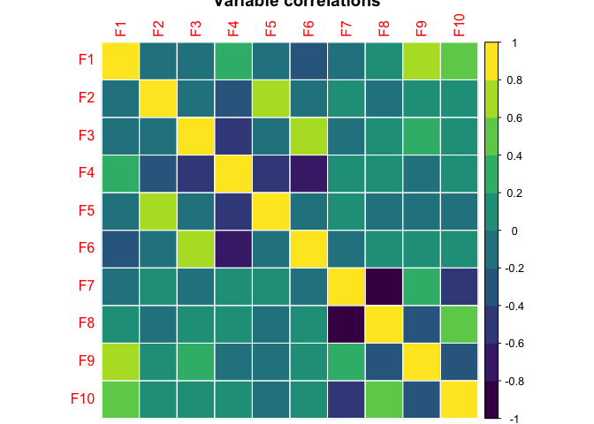

**significance test** Computing the p-value of correlations:

``` r
cor.mtest <- function(mat, ...) {
  mat <- as.matrix(mat)
  n <- ncol(mat)
  p.mat<- matrix(NA, n, n)
  diag(p.mat) <- 0
  for (i in 1:(n - 1)) {
    for (j in (i + 1):n) {
      tmp <- cor.test(mat[, i], mat[, j], ...)
      p.mat[i, j] <- p.mat[j, i] <- tmp$p.value
    }
  }
  colnames(p.mat) <- rownames(p.mat) <- colnames(mat)
  p.mat
}

p.mat <- cor.mtest(correlation.mat)
corrplot(correlation.mat, type="ful", order="hclust", p.mat = p.mat, sig.level = 0.01, method="color", main="Correlation & significance test", col=viridis(10))
```


Using the `caret` package to find correlated variables over a .9 threshold:

``` r
highlyCor <- findCorrelation(cor(DT3), .90, verbose = T)
```

    ## Compare row 8  and column  7 with corr  0.929 
    ##   Means:  0.226 vs 0.21 so flagging column 8 
    ## All correlations <= 0.9

High correlated variables where removed.

``` r
DT3$F7 <- NULL
DT3$F8 <- NULL
DT3$F9 <- NULL
DT3$F10 <- NULL
knitr::kable(head(DT3, 2))
```

|                      |   F1|   F2|   F3|   F4|   F5|   F6|
|----------------------|----:|----:|----:|----:|----:|----:|
| 002JN2ZPCA9DPVUE1Q7P |   70|    0|    0|    1|    0|    0|
| 0034SFJMXSQT5WX8QXY1 |  450|    0|    0|    1|    0|    0|

Testing the model
-----------------

k-means clustering has been used as a feature learning step, in either (semi-)supervised learning or unsupervised learning.

**Variable normalization**

**Trainning the model to find the optimal number of clusters**

``` r
wssse <- (nrow(DT3.s)-1)*sum(apply(DT3.s,2,var))
for(i in 2:15) wssse[i]<- sum(fit=kmeans(DT3.s,centers=i,15)$withinss)
plot(1:15,wssse,type="b",main="Testing for 15 clusters",xlab="Number of clusters",ylab="Within Set Sum of Squared Error", col=viridis(10))
```

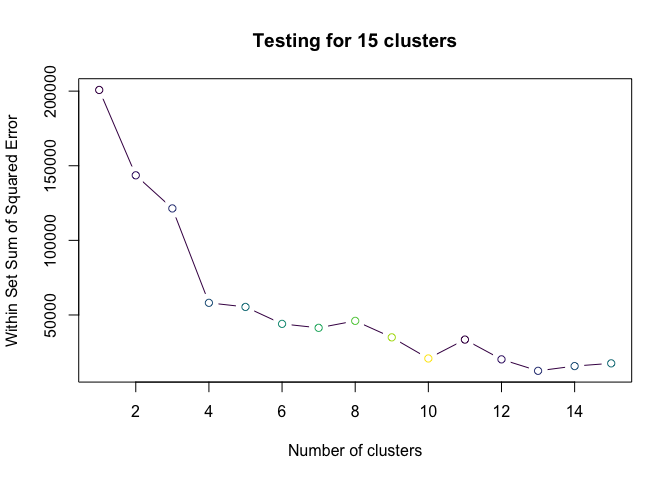

As we can see from the above output the slope of the graph changes majorly in 4th iteration, hence we consider the optimized number of cluster as 4 in which we can get the optimum result

**Trainning the algorithm to find 4 clusters**

``` r
fit <- kmeans(DT3.s, 4)

plot(DT3.s,col=fit$cluster,pch=15, main="Clustering", xlab = "F1: Mean withdrowall amount request (On us)", ylab = "F2: Mean withdrowall amount request (Inter-Sistemas)")
points(fit$centers,pch=4, cex = 1.9, col=viridis(4))
```

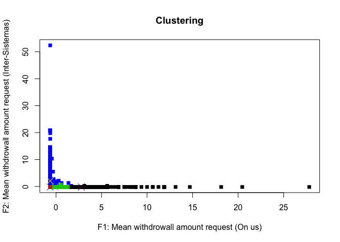

**Visualizing clustering results**

``` r
clusplot(DT3.s, fit$cluster, color=TRUE, shade=TRUE, labels=0, lines=0, col.p=viridis(4), main="Clustering results")
```

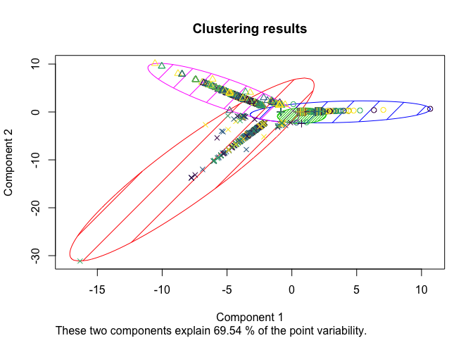

``` r
result.df <- data.frame(DT3[,c(1:6)],fit$cluster)
```

**Cheking cluster composition**

|  Group.1|      F1|      F2|      F3|    F4|    F5|    F6|
|--------:|-------:|-------:|-------:|-----:|-----:|-----:|
|        1|  548.17|    0.02|    0.02|  1.02|  0.00|  0.00|
|        2|    0.63|    0.00|  137.87|  0.01|  0.00|  1.02|
|        3|   85.59|    0.00|    0.00|  1.03|  0.00|  0.00|
|        4|    0.74|  107.33|    0.68|  0.01|  1.01|  0.01|

Next steps
----------

After this phase a R script ([data\_pre-processing.R](data_pre-processing.R)) was developed to automatically process the full data set, create the new features and save them into a CSV file. This file will be uploaded to a cluster in the cloud and stored on HDFS for later usage in Spark.

The full data pre-processing phase is explained in this notebook: [data\_pre-processing.ipynb](data_pre-processing.ipynb).
